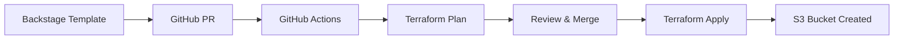

# 🚀 S3 Bucket Deployment Guide

This guide walks you through the complete GitOps workflow for deploying AWS S3 buckets using Backstage, GitHub Actions, and Terraform.

## 📋 Overview



## 🏗️ Initial Setup (One-time)

### Step 1: AWS OIDC Configuration

Run the provided setup script to configure AWS OIDC for GitHub Actions:

```bash
./scripts/setup-aws-oidc.sh
```

This script will:
- Create OIDC identity provider in AWS
- Create `GitHubActionsRole` IAM role
- Create necessary IAM policies
- Provide configuration details for GitHub

### Step 2: GitHub Repository Configuration

#### Set Repository Secrets
Go to your GitHub repository → Settings → Secrets and variables → Actions

**Required Secrets:**
```
AWS_ACCOUNT_ID: 123456789012
```

**Optional Multi-Environment Secrets:**
```
AWS_ACCOUNT_ID_DEV: 123456789012
AWS_ACCOUNT_ID_STAGING: 987654321098
AWS_ACCOUNT_ID_PROD: 456789012345
```

#### Set Repository Variables
```
AWS_REGION: us-east-1
AWS_REGION_DEV: us-east-1
AWS_REGION_STAGING: us-west-2
AWS_REGION_PROD: us-east-1
```

### Step 3: Terraform Backend Setup

1. Go to GitHub Actions tab
2. Select "Setup Terraform Backend" workflow
3. Click "Run workflow"
4. Provide:
   - **AWS Region**: `us-east-1`
   - **S3 Bucket Name**: `your-terraform-state-bucket-unique-name`
   - **DynamoDB Table**: `terraform-state-lock`

This will automatically:
- Create S3 bucket for Terraform state
- Create DynamoDB table for state locking
- Update GitHub repository secrets

## 🔄 Deployment Workflow

### Step 1: Create Infrastructure via Backstage

1. Open Backstage at http://localhost:3000
2. Navigate to "Create" → "Software Templates"
3. Select "Create AWS S3 Bucket"
4. Fill in the form:
   - **Bucket Name**: `my-app-bucket-dev`
   - **Region**: `us-east-1`
   - **Environment**: `dev`
   - **Account ID**: `123456789012`
   - **Repository URL**: `github.com?owner=YourOrg&repo=your-repo`

### Step 2: Review Generated Pull Request

Backstage will create a PR with:
- Terraform configuration files
- GitHub Actions workflows
- Documentation

**Files Created:**
```
infrastructure/s3/
├── main.tf
├── variables.tf
├── outputs.tf
└── README.md

.github/workflows/
├── terraform-deploy.yml
├── terraform-multi-env.yml
└── setup-terraform-backend.yml

.github/
└── README.md

scripts/
└── setup-aws-oidc.sh
```

### Step 3: Automated Plan Execution

When the PR is created, GitHub Actions automatically:
1. Runs `terraform fmt` check
2. Initializes Terraform with remote backend
3. Validates Terraform configuration
4. Runs `terraform plan`
5. Comments plan results on the PR

**Example PR Comment:**
```
#### Terraform Format and Style 🖌✅
#### Terraform Initialization ⚙️✅
#### Terraform Validation 🤖✅
#### Terraform Plan 📖✅

<details><summary>Show Plan</summary>

```terraform
Terraform will perform the following actions:

  # aws_s3_bucket.this will be created
  + resource "aws_s3_bucket" "this" {
      + bucket = "my-app-bucket-dev"
      + region = "us-east-1"
      ...
    }

Plan: 1 to add, 0 to change, 0 to destroy.
```

</details>
```

### Step 4: Review and Merge

1. **Review the Terraform plan** in the PR comment
2. **Verify the configuration** matches your requirements
3. **Check security settings** (encryption, public access blocking)
4. **Merge the PR** when satisfied

### Step 5: Automated Deployment

After merging, GitHub Actions automatically:
1. Runs `terraform apply` with auto-approval
2. Creates the S3 bucket in AWS
3. Captures and displays outputs
4. Comments deployment results

**Example Deployment Comment:**
```
#### Terraform Apply Completed ✅

**Infrastructure deployed successfully!**

**Outputs:**
```json
{
  "bucket_name": {
    "value": "my-app-bucket-dev"
  },
  "bucket_arn": {
    "value": "arn:aws:s3:::my-app-bucket-dev"
  }
}
```
```

## 🌍 Multi-Environment Deployments

### Branch Strategy

| Branch | Environment | Auto-Deploy |
|--------|-------------|-------------|
| `main` | Production | ✅ (with approval) |
| `develop` | Staging | ✅ |
| `feature/*` | Development | ✅ |

### Environment Configuration

Each environment can have different:
- AWS accounts
- AWS regions
- Resource configurations
- Approval requirements

### Deployment Process

1. **Development**: Push to feature branch → Auto-deploy to dev
2. **Staging**: Merge to develop → Auto-deploy to staging
3. **Production**: Merge to main → Deploy to prod (with approval)

## 🛡️ Security Features

### AWS OIDC Authentication
- No long-lived AWS credentials in GitHub
- Short-lived tokens for each workflow run
- Scoped permissions per repository

### Terraform State Security
- State stored in encrypted S3 bucket
- State locking prevents concurrent modifications
- Versioned state for rollback capability

### GitHub Environment Protection
- Required reviewers for production deployments
- Branch protection rules
- Deployment approval workflows

## 📊 Monitoring and Troubleshooting

### View Deployment Status

**GitHub Actions:**
- Go to Actions tab in your repository
- View workflow runs and logs
- Check deployment status and outputs

**AWS Console:**
- S3 Console: View created buckets
- CloudTrail: Audit API calls
- IAM: Monitor role usage

### Common Issues and Solutions

#### 1. OIDC Authentication Failed
```
Error: Could not assume role with OIDC
```
**Solution:**
- Verify OIDC provider exists in AWS
- Check IAM role trust policy
- Ensure repository name matches trust policy

#### 2. Terraform State Access Denied
```
Error: Failed to get existing workspaces
```
**Solution:**
- Run "Setup Terraform Backend" workflow
- Verify S3 bucket permissions
- Check IAM role has S3 access

#### 3. DynamoDB Lock Table Not Found
```
Error: ResourceNotFoundException: Table not found
```
**Solution:**
- Run "Setup Terraform Backend" workflow
- Verify DynamoDB table exists
- Check table name in workflow configuration

#### 4. Bucket Name Already Exists
```
Error: BucketAlreadyExists
```
**Solution:**
- S3 bucket names must be globally unique
- Choose a different bucket name
- Add random suffix or prefix

## 🔧 Customization

### Adding Custom Terraform Modules

1. **Update main.tf:**
```hcl
module "custom_module" {
  source = "./modules/custom"
  
  bucket_name = var.bucket_name
  environment = var.environment
}
```

2. **Add module directory:**
```
infrastructure/s3/modules/custom/
├── main.tf
├── variables.tf
└── outputs.tf
```

### Environment-Specific Configurations

**Using Terraform Workspaces:**
```bash
terraform workspace select dev
terraform plan -var-file="environments/dev.tfvars"
```

**Using Variable Files:**
```
environments/
├── dev.tfvars
├── staging.tfvars
└── prod.tfvars
```

### Custom GitHub Actions

**Add pre-deployment checks:**
```yaml
- name: Security Scan
  run: |
    # Run security scanning tools
    checkov -f main.tf
    tfsec .
```

**Add post-deployment tests:**
```yaml
- name: Test S3 Bucket
  run: |
    # Test bucket accessibility
    aws s3 ls s3://
```

## 📚 Best Practices

### Terraform
- Use consistent naming conventions
- Tag all resources appropriately
- Implement resource lifecycle rules
- Use data sources for existing resources

### GitHub Actions
- Use environment protection for production
- Implement proper secret management
- Monitor workflow execution times
- Set up notifications for failures

### AWS Security
- Follow least privilege principle
- Regularly rotate OIDC thumbprints
- Monitor CloudTrail logs
- Implement resource-based policies

## 🆘 Support and Resources

### Documentation
- [Terraform AWS Provider](https://registry.terraform.io/providers/hashicorp/aws/latest/docs)
- [GitHub Actions](https://docs.github.com/en/actions)
- [AWS OIDC Setup](https://docs.github.com/en/actions/deployment/security-hardening-your-deployments/configuring-openid-connect-in-amazon-web-services)

### Troubleshooting
- Check GitHub Actions logs for detailed error messages
- Review AWS CloudTrail for API call details
- Verify IAM permissions and trust policies
- Test Terraform commands locally if needed

### Getting Help
- Create GitHub issues for workflow problems
- Check AWS documentation for service-specific issues
- Review Terraform documentation for configuration help

---

🎉 **Congratulations!** You now have a complete GitOps workflow for deploying AWS infrastructure using Backstage, GitHub Actions, and Terraform.
